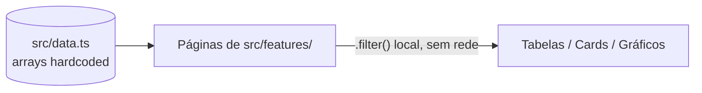

# Arquitetura

Descrição do funcionamento real do PainelAdmin, confirmada em `src/App.tsx`,
`src/main.tsx`, `src/types.ts` e nos componentes de `src/components/` e `src/features/`.

## Ponto de entrada

`src/main.tsx` monta `<App />` dentro de `<StrictMode>` no elemento `#root` de
`index.html`. Não há nenhuma outra camada entre o HTML e o componente `App`.

## Composição de `App.tsx`

`App` mantém dois estados locais via `useState`:

- `page: Page` — controla qual das 10 páginas é exibida. Inicializado como `'dashboard'`.
- `collapsed: boolean` — controla se a barra lateral está recolhida.

O corpo do componente monta um objeto `pages` que mapeia cada valor de `Page` ao elemento
JSX da página correspondente:

```ts
const pages: Record<Page, React.ReactNode> = {
  dashboard: <DashboardPage />,
  empresas: <EmpresasPage />,
  clientes: <ClientesPage />,
  servicos: <ServicosPage />,
  usuarios: <UsuariosPage />,
  agendamentos: <AgendamentosPage />,
  financeiro: <FinanceiroPage />,
  configuracoes: <ConfiguracoesPage />,
  perfil: <PerfilPage />,
  ia: <IAPage />,
};
```

O layout renderizado é sempre o mesmo: `<Sidebar>` (esquerda) + `<Topbar>` (topo) +
`{pages[page]}` (conteúdo principal, dentro de um `<main>` com scroll próprio). **Não existe
roteamento por URL** — trocar de página não altera a URL do navegador, não usa
`react-router-dom` (apesar de essa biblioteca estar declarada em `package.json`) e não é
reversível pelo botão "voltar" do navegador. A navegação acontece inteiramente por meio da
prop `onChange` passada ao `Sidebar`, que chama `setPage`.

## Sidebar e Topbar

- **`Sidebar.tsx`** recebe `current`, `onChange`, `collapsed`, `onToggle` como props. Contém
  duas listas fixas de itens de navegação declaradas no próprio arquivo: `navItems`
  (Dashboard, Empresas, Clientes, Serviços, Usuários, Agendamentos, Financeiro) e
  `bottomItems` (Configurações, Perfil, IA AutoNova). Clicar em um item chama
  `onChange(item.id as Page)`. O `id` de cada item precisa ser exatamente um dos valores do
  tipo `Page` — o cast `as Page` não é validado em tempo de execução.
- **`Topbar.tsx`** recebe apenas `page: Page` como prop. Usa um objeto `labels` (mapeamento
  fixo de cada `Page` para um array de strings de breadcrumb) para montar o texto exibido no
  cabeçalho (`AutoNova > <Página Atual>`). Também renderiza um campo de busca e um ícone de
  sino — nenhum dos dois está conectado a qualquer lógica (o campo de busca não filtra nada
  fora de si mesmo, o sino não abre nenhuma lista de notificações).

## Estado local por página

Não existe estado global nem Context API customizado no projeto. Cada página em
`src/features/` gerencia seu próprio estado local com `useState`, tipicamente para:

- texto de busca (`search`) — filtra o array de dados correspondente vindo de `src/data.ts`
  com `.filter()` e `.includes()` no navegador, sem nenhuma chamada de rede;
- página de paginação (`page`, conflitando de nome mas não de escopo com a variável `page`
  de `App.tsx` — são estados independentes em componentes diferentes);
- abertura/fechamento de modais (`modalOpen`, `deleteOpen`);
- item selecionado para edição/exclusão (`selected`);
- aba ativa dentro de uma página (`tab`/`section`/`view`), usada em `FinanceiroPage`,
  `PerfilPage`, `ConfiguracoesPage` e `AgendamentosPage`.

## Fluxo de dados



Todas as páginas importam diretamente de `../data` (ex.: `import { empresas } from
'../data'`). Não existe nenhuma camada intermediária de serviço, hook de dados ou chamada de
API entre `src/data.ts` e os componentes que o consomem — a filtragem por texto de busca
acontece com `Array.prototype.filter()` executado inteiramente no navegador sobre o array já
carregado. Ver o detalhamento completo de cada array em [`DADOS.md`](DADOS.md).

## Formulários e ações (Criar/Editar/Excluir)

`EmpresasPage.tsx` e `UsuariosPage.tsx` renderizam modais de criação/edição
(`Modal` de `src/components/ui.tsx`) com campos preenchidos a partir do item selecionado
(`selected?.nome`, `selected?.cnpj` etc.). Os botões "Salvar Alterações", "Criar Empresa" e
"Enviar Convite" desses modais **apenas fecham o modal** (`onClick={() => setModalOpen(false)}`)
— nenhum deles lê os valores digitados nos campos (`Input`/`Select` não têm `onChange`
conectado a um estado que seria salvo), nem grava qualquer alteração de volta em
`src/data.ts` ou em qualquer outro lugar. O mesmo vale para o modal de exclusão em
`EmpresasPage.tsx`: o botão "Excluir" só fecha o modal, sem remover o item da lista.

## A página de IA (`IAPage.tsx`)

Ver o comportamento completo, incluindo a discrepância entre o texto exibido na interface e
a implementação real, em
[`COMPONENTES.md#srcfeaturesiapagetsx--iapage`](COMPONENTES.md#srcfeaturesiapagetsx--iapage).

## Limitações arquiteturais confirmadas

- Sem roteamento por URL (uma única "rota" visual, controlada por estado em memória).
- Sem persistência de dados: todas as ações de criar/editar/excluir são apenas visuais.
- Sem chamada de rede em nenhuma página (`fetch`, `axios` não são usados em `src/`, apesar de
  `axios` estar em `package.json`).
- Sem autenticação/login implementados — o usuário "Ana Beatriz Lima" exibido na Sidebar,
  Topbar e PerfilPage é um valor fixo no código (`<Avatar name="Ana Beatriz Lima" ... />`),
  não o resultado de uma sessão autenticada.


